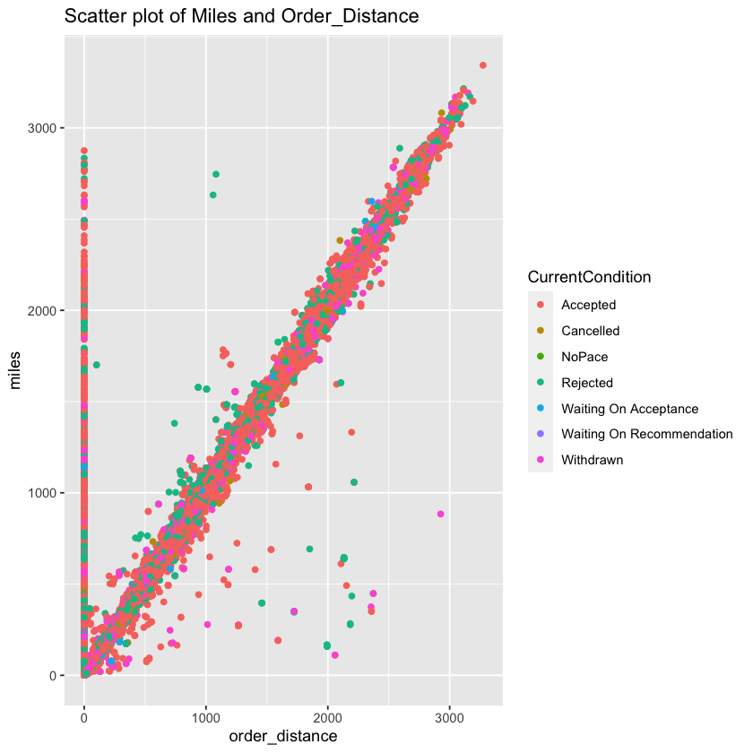
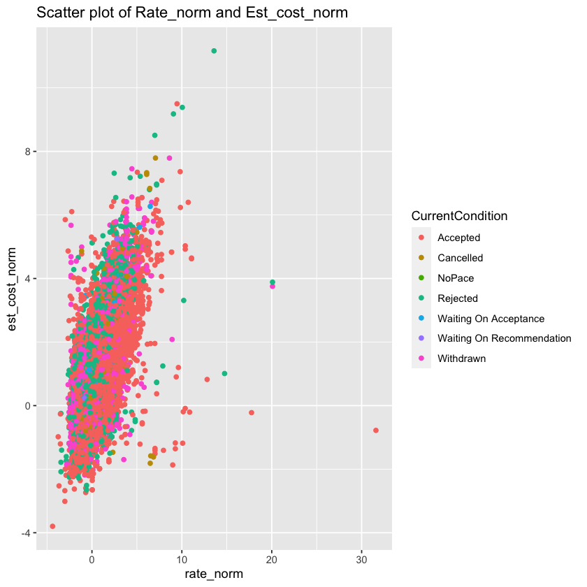

CH Robinson Interview Project
Alec Paulson

```R
# Initializations
library(ggplot2)
library(e1071)
library(nnet)
install.packages("ISLR")
install.packages("tree")
library(tree)
library(ISLR)
```

This analysis constructs classifiers for our inferential target, CurrentCondition - a factor variable indicating order status. In this most initial section, I import the provided data and inpsect the levels of the target variable. I observe seven non-missing levels, which are highly unbalanced. In particular, approximately 60% of the orders have condition status "Accepted", compared to .05% of the orders having condition statuts "Waiting On Recommendation". The unbalance informs our selection of reasonable classification methods. For example, I hesitate to use support vector machines because designing weighting contrasts without much domain knowledge is probably ill-conceived. There are 16,156,315 rows in the data and 15 columns (after removing the intelligence-free row counter column).


```R
# Data and notebook setup

#### import, inspect data elements
setwd("/Users/alecpaulson/Desktop")
raw <- read.csv("IMA Recommendation Simulation Data.csv")
raw <- subset(raw,select=-c(X))
head(raw,10)
names(raw)
dim(raw) # data shape

#### inspect levels of inferential target - there 7 non-missing levels of the inferential target
unique(raw$CurrentCondition)
raw1 <- raw[which(raw$CurrentCondition != ""),] # remove missing target level
100* table(raw1$CurrentCondition) / dim(raw1)[1]
```


<table class="dataframe">
<caption>A data.frame: 10 × 15</caption>
<thead>
	<tr><th></th><th scope=col>request_id</th><th scope=col>week_id</th><th scope=col>weekday</th><th scope=col>miles</th><th scope=col>order_equipment_type</th><th scope=col>order_distance</th><th scope=col>order_num_stops</th><th scope=col>order_origin_weight</th><th scope=col>lead_days</th><th scope=col>color</th><th scope=col>origin_dat_ref</th><th scope=col>dest_dat_ref</th><th scope=col>rate_norm</th><th scope=col>est_cost_norm</th><th scope=col>CurrentCondition</th></tr>
	<tr><th></th><th scope=col>&lt;chr&gt;</th><th scope=col>&lt;int&gt;</th><th scope=col>&lt;chr&gt;</th><th scope=col>&lt;int&gt;</th><th scope=col>&lt;chr&gt;</th><th scope=col>&lt;int&gt;</th><th scope=col>&lt;int&gt;</th><th scope=col>&lt;int&gt;</th><th scope=col>&lt;int&gt;</th><th scope=col>&lt;chr&gt;</th><th scope=col>&lt;int&gt;</th><th scope=col>&lt;int&gt;</th><th scope=col>&lt;dbl&gt;</th><th scope=col>&lt;dbl&gt;</th><th scope=col>&lt;chr&gt;</th></tr>
</thead>
<tbody>
	<tr><th scope=row>1</th><td>c2653eda11cd4d94879d1946392eb2b5</td><td>4</td><td>Sat</td><td>1856</td><td>V</td><td>1848</td><td>2</td><td>40000</td><td>3</td><td>RED   </td><td>633</td><td>978</td><td> 2.2734418</td><td> 2.1386311</td><td>Accepted </td></tr>
	<tr><th scope=row>2</th><td>65e3dcc84a2246e68ea8636a967b31b2</td><td>3</td><td>Mon</td><td>  56</td><td>V</td><td>  47</td><td>2</td><td>12729</td><td>3</td><td>RED   </td><td>604</td><td>604</td><td>-0.9710296</td><td>-1.0170243</td><td>Rejected </td></tr>
	<tr><th scope=row>3</th><td>0a86f005640a4204b46c95ca033a7ced</td><td>1</td><td>Fri</td><td> 259</td><td>V</td><td> 255</td><td>2</td><td>44176</td><td>3</td><td>RED   </td><td>761</td><td>770</td><td>-0.3933519</td><td>-0.4758051</td><td>Accepted </td></tr>
	<tr><th scope=row>4</th><td>1105b4bc7b444f7985d4ad810e7acbc2</td><td>3</td><td>Thu</td><td>  71</td><td>V</td><td>  68</td><td>2</td><td>39847</td><td>6</td><td>RED   </td><td>187</td><td>180</td><td>-0.7065458</td><td>-0.7658554</td><td>Rejected </td></tr>
	<tr><th scope=row>5</th><td>de538100bb0f4137961b9551640ef35e</td><td>3</td><td>Fri</td><td>1182</td><td>R</td><td>1183</td><td>2</td><td>34912</td><td>3</td><td>GREEN </td><td>972</td><td>922</td><td> 1.0142333</td><td> 0.4692729</td><td>Accepted </td></tr>
	<tr><th scope=row>6</th><td>07a9cc6adbe642748618a5c8e61348a1</td><td>4</td><td>Tue</td><td>1205</td><td>V</td><td>1166</td><td>2</td><td>44493</td><td>1</td><td>RED   </td><td>775</td><td>551</td><td> 0.4255890</td><td> 1.4423836</td><td>Accepted </td></tr>
	<tr><th scope=row>7</th><td>1de99bdecbf147ee8a8d4b00c812f836</td><td>4</td><td>Tue</td><td> 952</td><td>V</td><td> 940</td><td>2</td><td>13352</td><td>3</td><td>RED   </td><td>605</td><td> 10</td><td> 1.3152568</td><td> 1.6430496</td><td>Accepted </td></tr>
	<tr><th scope=row>8</th><td>6e07ff5c7f7e4d27976b9779dab3f4fd</td><td>3</td><td>Fri</td><td> 671</td><td>V</td><td> 644</td><td>2</td><td>26763</td><td>3</td><td>GREEN </td><td>610</td><td>378</td><td> 0.5705724</td><td>-0.1260114</td><td>Withdrawn</td></tr>
	<tr><th scope=row>9</th><td>8f67eb6f89ff40bcb4289f1f62227df6</td><td>1</td><td>Wed</td><td> 154</td><td>V</td><td> 141</td><td>2</td><td>45679</td><td>6</td><td>YELLOW</td><td>326</td><td>347</td><td>-0.1543305</td><td>-1.2823680</td><td>Accepted </td></tr>
	<tr><th scope=row>10</th><td>2e250448220c47a18e5494697d835706</td><td>1</td><td>Wed</td><td> 665</td><td>V</td><td> 661</td><td>2</td><td>41220</td><td>5</td><td>YELLOW</td><td>882</td><td>775</td><td>-0.9791274</td><td>-0.8282605</td><td>Withdrawn</td></tr>
</tbody>
</table>


<style>
.list-inline {list-style: none; margin:0; padding: 0}
.list-inline>li {display: inline-block}
.list-inline>li:not(:last-child)::after {content: "\00b7"; padding: 0 .5ex}
</style>
<ol class=list-inline><li>'request_id'</li><li>'week_id'</li><li>'weekday'</li><li>'miles'</li><li>'order_equipment_type'</li><li>'order_distance'</li><li>'order_num_stops'</li><li>'order_origin_weight'</li><li>'lead_days'</li><li>'color'</li><li>'origin_dat_ref'</li><li>'dest_dat_ref'</li><li>'rate_norm'</li><li>'est_cost_norm'</li><li>'CurrentCondition'</li></ol>


<style>
.list-inline {list-style: none; margin:0; padding: 0}
.list-inline>li {display: inline-block}
.list-inline>li:not(:last-child)::after {content: "\00b7"; padding: 0 .5ex}
</style>
<ol class=list-inline><li>161563</li><li>15</li></ol>


<style>
.list-inline {list-style: none; margin:0; padding: 0}
.list-inline>li {display: inline-block}
.list-inline>li:not(:last-child)::after {content: "\00b7"; padding: 0 .5ex}
</style>
<ol class=list-inline><li>'Accepted'</li><li>'Rejected'</li><li>'Withdrawn'</li><li>'Waiting On Acceptance'</li><li>'Cancelled'</li><li>''</li><li>'Waiting On Recommendation'</li><li>'NoPace'</li></ol>


    
                     Accepted                 Cancelled                    NoPace 
                  59.56517700                2.09854749                0.03344792 
                     Rejected     Waiting On Acceptance Waiting On Recommendation 
                  23.00659667                0.49552479                0.05884357 
                    Withdrawn 
                  14.74186255 


```R
# Exploratory data analysis

#### is request_id unique?

length(unique(raw1$request_id)); dim(raw1) # appears to be one duplicate

# find the duplicate, inspect it
dups <- duplicated(raw1$request_id)

#### this is a true duplicate. let's remove one of these duplicated rows from the sample, keep the other.
raw1[raw1$request_id %in% unique(raw1$request_id[dups]),]
raw2 <- raw1[!dups,]
dim(raw2)

#### Is there any missing data in this data set? If so, which columns have missing data?
sapply(raw2, function(x) sum(is.na(x)))

####  following features have missing data: (1) order_distance, (2) order_origin_weight, 
####  (3) rate_nrom, (4) est_cost_norm

####  Are there any features you would consider highly correlated? Please limit this to two
####  pairs and describe why you selected the two pairs. Demonstrate this correlation
####  numerically and visually.

####  make a couple of the variables character, based on data dictionary
raw2$order_num_stops <- as.character(raw2$order_num_stops)
raw2$origin_dat_ref <- as.character(raw2$origin_dat_ref)
raw2$dest_dat_ref <- as.character(raw2$dest_dat_ref)
raw2$week_id <- as.character(raw2$week_id)

####  start with numeric variables
num.cols <- unlist(lapply(raw2, is.numeric))
names(raw2)[num.cols]
cor(raw2[complete.cases(raw2),num.cols])
####  ====> (1) miles/order_distance, (2) rate_nrom/est_cost_norm are highly correlated

#### plot numeric variable pairs exhibiting correlation

#### miles/order_distance appear to be linear functions of one another. But, there exists requests
####  for which the miles are greater than zero, but order distance is zero. This makes better sense on 
####  inspection of the data dictionary.
plotDat <-raw2[complete.cases(raw2),]
ggplot(plotDat, aes(x=order_distance, y=miles, color=CurrentCondition)) +
    geom_point() +
    ggtitle("Scatter plot of Miles and Order_Distance")

####  shipment costs correlate with customer payments, makes sense.
ggplot(plotDat, aes(x=rate_norm, y=est_cost_norm, color=CurrentCondition)) +
    geom_point() +
    ggtitle("Scatter plot of Rate_norm and Est_cost_norm")

#### assess correlations between target and categorical variables
getHist <- function(var){
    hist()
}
```


161444


<style>
.list-inline {list-style: none; margin:0; padding: 0}
.list-inline>li {display: inline-block}
.list-inline>li:not(:last-child)::after {content: "\00b7"; padding: 0 .5ex}
</style>
<ol class=list-inline><li>161445</li><li>15</li></ol>


<table class="dataframe">
<caption>A data.frame: 2 × 15</caption>
<thead>
	<tr><th></th><th scope=col>request_id</th><th scope=col>week_id</th><th scope=col>weekday</th><th scope=col>miles</th><th scope=col>order_equipment_type</th><th scope=col>order_distance</th><th scope=col>order_num_stops</th><th scope=col>order_origin_weight</th><th scope=col>lead_days</th><th scope=col>color</th><th scope=col>origin_dat_ref</th><th scope=col>dest_dat_ref</th><th scope=col>rate_norm</th><th scope=col>est_cost_norm</th><th scope=col>CurrentCondition</th></tr>
	<tr><th></th><th scope=col>&lt;chr&gt;</th><th scope=col>&lt;int&gt;</th><th scope=col>&lt;chr&gt;</th><th scope=col>&lt;int&gt;</th><th scope=col>&lt;chr&gt;</th><th scope=col>&lt;int&gt;</th><th scope=col>&lt;int&gt;</th><th scope=col>&lt;int&gt;</th><th scope=col>&lt;int&gt;</th><th scope=col>&lt;chr&gt;</th><th scope=col>&lt;int&gt;</th><th scope=col>&lt;int&gt;</th><th scope=col>&lt;dbl&gt;</th><th scope=col>&lt;dbl&gt;</th><th scope=col>&lt;chr&gt;</th></tr>
</thead>
<tbody>
	<tr><th scope=row>81224</th><td>f0293ccd87b445f5989c6c68726608dc</td><td>3</td><td>Fri</td><td>147</td><td>V</td><td>151</td><td>2</td><td>45007</td><td>3</td><td>RED</td><td>983</td><td>972</td><td>-0.6218265</td><td>-0.3533527</td><td>Withdrawn</td></tr>
	<tr><th scope=row>81225</th><td>f0293ccd87b445f5989c6c68726608dc</td><td>3</td><td>Fri</td><td>147</td><td>V</td><td>151</td><td>2</td><td>45007</td><td>3</td><td>RED</td><td>983</td><td>972</td><td>-0.6218265</td><td>-0.3533527</td><td>Withdrawn</td></tr>
</tbody>
</table>


<style>
.list-inline {list-style: none; margin:0; padding: 0}
.list-inline>li {display: inline-block}
.list-inline>li:not(:last-child)::after {content: "\00b7"; padding: 0 .5ex}
</style>
<ol class=list-inline><li>161444</li><li>15</li></ol>


<style>
.dl-inline {width: auto; margin:0; padding: 0}
.dl-inline>dt, .dl-inline>dd {float: none; width: auto; display: inline-block}
.dl-inline>dt::after {content: ":\0020"; padding-right: .5ex}
.dl-inline>dt:not(:first-of-type) {padding-left: .5ex}
</style><dl class=dl-inline><dt>request_id</dt><dd>0</dd><dt>week_id</dt><dd>0</dd><dt>weekday</dt><dd>0</dd><dt>miles</dt><dd>0</dd><dt>order_equipment_type</dt><dd>0</dd><dt>order_distance</dt><dd>4678</dd><dt>order_num_stops</dt><dd>0</dd><dt>order_origin_weight</dt><dd>19</dd><dt>lead_days</dt><dd>0</dd><dt>color</dt><dd>0</dd><dt>origin_dat_ref</dt><dd>0</dd><dt>dest_dat_ref</dt><dd>0</dd><dt>rate_norm</dt><dd>181</dd><dt>est_cost_norm</dt><dd>39</dd><dt>CurrentCondition</dt><dd>0</dd></dl>


<style>
.list-inline {list-style: none; margin:0; padding: 0}
.list-inline>li {display: inline-block}
.list-inline>li:not(:last-child)::after {content: "\00b7"; padding: 0 .5ex}
</style>
<ol class=list-inline><li>'miles'</li><li>'order_distance'</li><li>'order_origin_weight'</li><li>'lead_days'</li><li>'rate_norm'</li><li>'est_cost_norm'</li></ol>


<table class="dataframe">
<caption>A matrix: 6 × 6 of type dbl</caption>
<thead>
	<tr><th></th><th scope=col>miles</th><th scope=col>order_distance</th><th scope=col>order_origin_weight</th><th scope=col>lead_days</th><th scope=col>rate_norm</th><th scope=col>est_cost_norm</th></tr>
</thead>
<tbody>
	<tr><th scope=row>miles</th><td> 1.00000000</td><td> 0.98227008</td><td>-0.01039877</td><td> 0.025699588</td><td> 0.701191133</td><td> 0.745788683</td></tr>
	<tr><th scope=row>order_distance</th><td> 0.98227008</td><td> 1.00000000</td><td>-0.01005972</td><td> 0.027588610</td><td> 0.689047918</td><td> 0.730781284</td></tr>
	<tr><th scope=row>order_origin_weight</th><td>-0.01039877</td><td>-0.01005972</td><td> 1.00000000</td><td> 0.011676543</td><td>-0.008708150</td><td>-0.011077201</td></tr>
	<tr><th scope=row>lead_days</th><td> 0.02569959</td><td> 0.02758861</td><td> 0.01167654</td><td> 1.000000000</td><td>-0.006124653</td><td>-0.005707185</td></tr>
	<tr><th scope=row>rate_norm</th><td> 0.70119113</td><td> 0.68904792</td><td>-0.00870815</td><td>-0.006124653</td><td> 1.000000000</td><td> 0.805328260</td></tr>
	<tr><th scope=row>est_cost_norm</th><td> 0.74578868</td><td> 0.73078128</td><td>-0.01107720</td><td>-0.005707185</td><td> 0.805328260</td><td> 1.000000000</td></tr>
</tbody>
</table>


    

    


    

    


```R
# Classification modeling - 2 approaches

raw2$CurrentCondition.f <- as.factor(raw2$CurrentCondition)
raw3 <- subset(raw2, select = -c(CurrentCondition,request_id) )
raw4 <- raw3[complete.cases(raw3),]

set.seed(1212)
train.size <- 6/10
train.rows <- sample(1:dim(raw4)[1],round(dim(raw4)[1]*train.size),replace=FALSE)
train.data <- raw4[train.rows,]
test.data <- raw4[train.rows,]
names(train.data)

#### on this split order_num_stops has a single level. drop this variable
#### drop date references - these are treated as intelligence-free in the model
train.data <- subset(train.data,select = -c(order_num_stops))
test.data <- subset(test.data,select = -c(order_num_stops))
```


<style>
.list-inline {list-style: none; margin:0; padding: 0}
.list-inline>li {display: inline-block}
.list-inline>li:not(:last-child)::after {content: "\00b7"; padding: 0 .5ex}
</style>
<ol class=list-inline><li>'week_id'</li><li>'weekday'</li><li>'miles'</li><li>'order_equipment_type'</li><li>'order_distance'</li><li>'order_num_stops'</li><li>'order_origin_weight'</li><li>'lead_days'</li><li>'color'</li><li>'origin_dat_ref'</li><li>'dest_dat_ref'</li><li>'rate_norm'</li><li>'est_cost_norm'</li><li>'CurrentCondition.f'</li></ol>


```R
## Try Naive Bayes

#### model
nb <- naiveBayes(CurrentCondition.f ~ .,data=train.data)
summary(nb)
table(predict(nb,test.data))
results <- cbind(test.data$CurrentCondition.f,predict(nb,test.data))

conf.mat.nb <- as.matrix(table(results[,1],results[,2]))
```


              Length Class  Mode     
    apriori    7     table  numeric  
    tables    12     -none- list     
    levels     7     -none- character
    isnumeric 12     -none- logical  
    call       4     -none- call     


    
                     Accepted                 Cancelled                    NoPace 
                        53476                      1244                       302 
                     Rejected     Waiting On Acceptance Waiting On Recommendation 
                        27973                      1125                        26 
                    Withdrawn 
                         9795 


```R
## Try multinomial regression

#### model 
mn.mod <- multinom(CurrentCondition.f ~ week_id+weekday+order_equipment_type+order_distance+
                   order_origin_weight+lead_days+color+est_cost_norm, data =train.data)
summary(mn.mod)
preds <- predict(mn.mod,test.data)
results <- as.data.frame(cbind(test.data$CurrentCondition.f,preds))

conf.mat.mn <- as.matrix(table(results[,1],results[,2]))
```

    # weights:  126 (102 variable)
    initial  value 182800.745312 
    iter  10 value 143249.985692
    iter  20 value 119106.485507
    iter  30 value 106778.015985
    iter  40 value 102438.100305
    iter  50 value 96102.016836
    iter  60 value 93505.456232
    iter  70 value 92286.499992
    iter  80 value 90776.890863
    iter  90 value 89075.721245
    iter 100 value 87426.447326
    final  value 87426.447326 
    stopped after 100 iterations


    Call:
    multinom(formula = CurrentCondition.f ~ week_id + weekday + order_equipment_type + 
        order_distance + order_origin_weight + lead_days + color + 
        est_cost_norm, data = train.data)
    
    Coefficients:
                              (Intercept)    week_id2   week_id3     week_id4
    Cancelled                   -4.198578  0.21018679  0.9837742  0.277469392
    NoPace                      -6.026180  0.32296960  0.1506482  0.195909851
    Rejected                    -3.780568 -0.02795693 -0.1770872 -0.096578539
    Waiting On Acceptance       -5.714868  0.02772958  0.1640782  0.074587056
    Waiting On Recommendation   -6.929479  0.03203325 -0.3645615  0.044006325
    Withdrawn                   -3.636506  0.14810605  0.2099183 -0.006189602
                               weekdayMon   weekdaySat weekdaySun  weekdayThu
    Cancelled                  0.64551464   0.82497039 -6.4007945  0.26392899
    NoPace                    -0.09740775 -11.68374735 -1.0838444 -0.03539202
    Rejected                   0.01650838  -0.83254312 -0.8617863  0.04014074
    Waiting On Acceptance      0.61833394  -1.36135267  1.8862117  0.73932335
    Waiting On Recommendation -0.32657884  -1.20690744 -2.9259798 -0.17815396
    Withdrawn                 -0.09237789   0.02681273  0.2175244 -0.15098374
                               weekdayTue  weekdayWed order_equipment_typeV
    Cancelled                  0.21852964  0.14295391           -0.02358955
    NoPace                    -0.51932081  0.40861054           -0.04085727
    Rejected                   0.04407682  0.09162393           -0.19362375
    Waiting On Acceptance      0.18436721  0.28862943           -0.23442552
    Waiting On Recommendation  0.64699820 -0.81272040            0.86238952
    Withdrawn                 -0.02498077 -0.10933025            0.37139191
                              order_distance order_origin_weight   lead_days
    Cancelled                  -0.0001808305       -1.955792e-06 -0.02345184
    NoPace                     -0.0004200167        2.974883e-05 -0.01271471
    Rejected                   -0.0003591732        2.171964e-05 -0.03524342
    Waiting On Acceptance       0.0001874007        3.537573e-06  0.02624918
    Waiting On Recommendation   0.0001940844        2.492206e-05 -0.02000688
    Withdrawn                  -0.0002676007        3.440171e-05 -0.01130280
                               colorRED colorYELLOW est_cost_norm
    Cancelled                 1.0798042 -0.55302708    0.11623066
    NoPace                    0.6553828 -0.24463789    0.12986056
    Rejected                  3.4021819  1.92763070    0.26533943
    Waiting On Acceptance     1.1418288 -0.01190322    0.03786385
    Waiting On Recommendation 1.1269313 -0.79724383   -0.01174332
    Withdrawn                 1.3720104  0.53242961    0.19006259
    
    Std. Errors:
                               (Intercept)     week_id2     week_id3     week_id4
    Cancelled                 3.099392e-07 6.769155e-08 1.829230e-07 3.792901e-08
    NoPace                    3.826866e-08 6.269486e-09 5.923731e-09 1.315563e-08
    Rejected                  1.637612e-05 5.396591e-06 5.937679e-06 2.322492e-06
    Waiting On Acceptance     9.592944e-08 7.475196e-09 4.326280e-09 3.475854e-08
    Waiting On Recommendation 3.197479e-08 1.415374e-08 1.567778e-08 5.668343e-09
    Withdrawn                 1.142191e-05 4.137132e-06 4.966849e-06 1.183927e-06
                                weekdayMon   weekdaySat   weekdaySun   weekdayThu
    Cancelled                 1.880689e-08 2.434001e-09 1.057827e-12 1.254645e-07
    NoPace                    1.884308e-08 5.341731e-15 4.540792e-10 3.795758e-09
    Rejected                  2.734636e-06 2.434990e-07 6.246853e-08 5.828576e-06
    Waiting On Acceptance     8.806879e-09 2.617416e-10 2.213233e-08 7.911212e-08
    Waiting On Recommendation 7.689374e-09 2.108493e-10 3.675799e-11 1.725808e-08
    Withdrawn                 2.984151e-06 2.840114e-07 3.146951e-07 3.578288e-06
                                weekdayTue   weekdayWed order_equipment_typeV
    Cancelled                 3.087571e-08 8.084298e-08          2.192449e-07
    NoPace                    8.256239e-09 9.499163e-09          5.133625e-08
    Rejected                  4.078662e-07 4.608800e-06          1.154732e-05
    Waiting On Acceptance     1.520596e-08 4.960256e-08          2.130577e-08
    Waiting On Recommendation 7.818260e-09 4.868988e-09          2.237107e-08
    Withdrawn                 8.032634e-10 2.959680e-06          8.768846e-06
                              order_distance order_origin_weight    lead_days
    Cancelled                   3.636161e-05        8.220537e-07 1.376332e-05
    NoPace                      9.407435e-05        1.711531e-06 1.185131e-06
    Rejected                    1.557641e-05        3.497734e-07 1.172944e-03
    Waiting On Acceptance       5.600011e-05        1.431722e-06 7.157785e-06
    Waiting On Recommendation   7.206760e-05        1.609691e-06 2.507822e-06
    Withdrawn                   1.764913e-05        3.775544e-07 1.121600e-03
                                  colorRED  colorYELLOW est_cost_norm
    Cancelled                 2.113726e-07 4.647400e-09  3.420392e-07
    NoPace                    3.376649e-08 7.177194e-09  1.112115e-07
    Rejected                  1.485634e-05 2.053452e-06  2.035717e-05
    Waiting On Acceptance     1.024479e-07 3.973653e-09  8.256045e-08
    Waiting On Recommendation 1.364816e-08 1.847897e-09  1.070121e-07
    Withdrawn                 9.995248e-06 2.349319e-06  1.558723e-05
    
    Residual Deviance: 174852.9 
    AIC: 175056.9 


```R
### Results:
conf.mat.nb
print(paste("Naive Bayes error rate: ",1-(sum(diag(conf.mat.mn)))/sum(conf.mat.mn)),sep="")
conf.mat.mn
print(paste("Multinomial error rate: ",1-(sum(c(50765,6998,15))/sum(conf.mat.mn)),sep=""))
```


       
            1     2     3     4     5     6     7
      1 41940   369   211  9492   543     4  3491
      2   821   458     3   434    38     1   163
      3    11     0     5    19     0     0     1
      4  5456   232    26 14241   244     9  1250
      5   159    12     8   108   108     0    52
      6     9     0     0    10     0     4    30
      7  5080   173    49  3669   192     8  4808


    [1] "Naive Bayes error rate:  0.45635026239874"


       
            1     4     5     7
      1 50766  5242     2    40
      2  1610   305     0     3
      3    25    11     0     0
      4 14460  6998     0     0
      5   342   104     0     1
      6    41    12     0     0
      7 10495  3469     0    15


    [1] "Multinomial error rate: 0.384954386263719"

